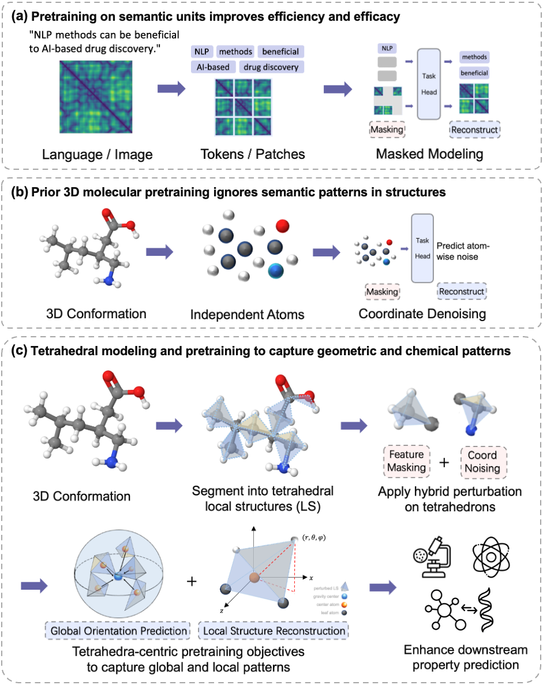

# Tetrahedral Molecular Pretraining


## Overview




## Installation

- Clone this repository

- Install the dependencies (Using [Anaconda](https://www.anaconda.com/), tested with CUDA version 11.0)

```shell
cd ./Transformer-M
conda env create -f requirement.yaml
conda activate Transformer-M
pip install torch==1.7.1+cu110 torchvision==0.8.2+cu110 torchaudio==0.7.2 -f https://download.pytorch.org/whl/torch_stable.html
pip install torch_geometric==1.6.3
pip install torch_scatter==2.0.7
pip install torch_sparse==0.6.9
pip install azureml-defaults
pip install rdkit-pypi cython
python setup.py build_ext --inplace
python setup_cython.py build_ext --inplace
pip install -e .
pip install --upgrade protobuf==3.20.1
pip install --upgrade tensorboard==2.9.1
pip install --upgrade tensorboardX==2.5.1
```

## Pretraining on PCQM4Mv2
```shell
export data_path='./datasets/pcq-pos'               # path to data
export save_path='./uniform_noise/'                          # path to logs

export lr=2e-4                                      # peak learning rate
export warmup_steps=150000                          # warmup steps
export total_steps=1500000                          # total steps
export layers=12                                    # set layers=18 for 18-layer model
export hidden_size=768                              # dimension of hidden layers
export ffn_size=768                                 # dimension of feed-forward layers
export num_head=32                                  # number of attention heads
export batch_size=256                               # batch size for a single gpu
export dropout=0.0
export act_dropout=0.1
export attn_dropout=0.1
export weight_decay=0.0
export droppath_prob=0.1                            # probability of stochastic depth
export noise_scale=0.2                              # noise scale
export mode_prob="1.0,0.0,0.0"                      # mode distribution for {2D+3D, 2D, 3D}
export dataset_name="PCQM4M-LSC-V2-3D"
export add_3d="true"
export num_3d_bias_kernel=128                       # number of Gaussian Basis kernels

bash lego_pretrain.sh
```

The pretrained checkpoint model can be downloaded [here](https://figshare.com/articles/software/pretrained_checkpoint_pt/27967470?file=50994258).
Download the checkpoint and put it in the root directory as "pretrained_ckpt.pt".

## Evaluation on MoleculeNet
```shell
task_name="bbbp"  # bbbp as example, more supported task names can be found in the script
bash finetune_molnet.sh $task_name
```

## Evaluation on QM9
```shell
task_idx=0   # task idx ranges from 0 to 11
bash finetune_qm9_lego_noisynode.sh $task_idx
```


## Evaluation on MD17
```shell
task_idx=0   # task idx ranges from 0 to 7
bash finetune_md17_noisynode.sh $task_idx
```

## Acknowledgement
This codebase is largely based on [Transformer-M](https://github.com/lsj2408/Transformer-M).
We would like to express our sincere gratitude for their invaluable contributions to this work.